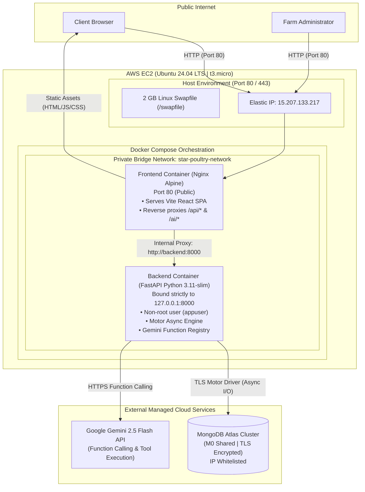
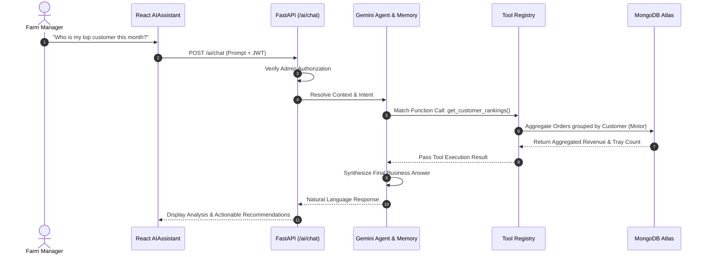
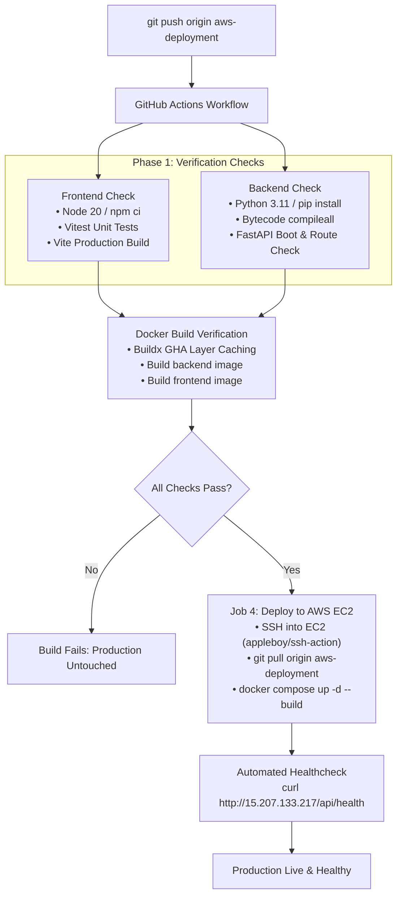

# Star Poultry Farm AI & Business Intelligence Platform

An enterprise SaaS farm management, financial intelligence, and automated operations platform built for wholesale egg and poultry distribution. The system manages daily tray orders, tracks operating expenses, calculates net profit margins, monitors customer lifetime value, and delivers an intelligent business copilot powered by Google Gemini Function Calling.

Deployed in production on **Amazon Web Services (AWS EC2)** with containerized multi-stage Docker builds, an Nginx reverse proxy, automated GitHub Actions CI/CD, and MongoDB Atlas.

---

## Table of Contents

1. [System Architecture](#system-architecture)
2. [Technology Stack](#technology-stack)
3. [Core Engineering Modules](#core-engineering-modules)
   - [Authentication & Role-Based Access Control](#1-authentication--role-based-access-control-rbac)
   - [Gemini Function-Calling AI Copilot](#2-gemini-function-calling-ai-copilot)
   - [Event-Driven Alert Engine](#3-event-driven-alert-engine)
   - [Database Architecture & Indexes](#4-database-architecture--indexes)
4. [Cloud Infrastructure & Production Hardening](#cloud-infrastructure--production-hardening)
5. [CI/CD & GitOps Pipeline](#cicd--gitops-pipeline)
6. [Repository & Branching Strategy](#repository--branching-strategy)
7. [Environment Variables Reference](#environment-variables-reference)
8. [Local Development Setup](#local-development-setup)
9. [Production Operations & Runbook](#production-operations--runbook)
10. [AI Capabilities & Roadmap](#ai-capabilities--roadmap)

---

## System Architecture

The application runs in an isolated containerized environment on an AWS EC2 instance. All external HTTP traffic enters through an Nginx reverse proxy, which serves the compiled React single-page application (SPA) and forwards API requests internally across a private Docker network.



---

## Technology Stack

| Layer | Technologies | Purpose |
| :--- | :--- | :--- |
| **Frontend UI** | React 18, TypeScript, Vite | Component-driven single page application |
| **Styling & Components** | Tailwind CSS, Radix UI (shadcn/ui), Lucide Icons | Accessible, responsive, dark-mode ready design system |
| **Data Visualization** | Recharts | Financial trends, expense distributions, and revenue graphs |
| **State & Networking** | TanStack Query (React Query), Axios | Server-state caching, optimistic updates, and API clients |
| **Backend API** | Python 3.11, FastAPI, Uvicorn | High-performance asynchronous REST API |
| **Database & ODM** | MongoDB Atlas, Motor (AsyncIO Driver) | Scalable NoSQL document store with non-blocking cursors |
| **Authentication** | JWT (JSON Web Tokens), Passlib (Bcrypt) | Stateless token sessions with role-based dependencies |
| **Artificial Intelligence** | Google GenAI SDK (`gemini-2.5-flash`) | Structured function calling, tool registry, conversation memory |
| **Containerization** | Docker, Docker Compose, Multi-stage Builds | Reproducible development and production environments |
| **Web Server / Proxy** | Nginx (Alpine Linux) | Reverse proxy, static file serving, HTTP compression |
| **CI/CD** | GitHub Actions | Automated linting, Vitest tests, Buildx caching, and EC2 CD |
| **Cloud Hosting** | AWS EC2 (`t3.micro`, ap-south-1 Mumbai) | Cloud computing host with allocated Elastic IP |

---

## Core Engineering Modules

### 1. Authentication & Role-Based Access Control (RBAC)

The application implements stateless JWT bearer authentication:
- **Token Generation**: On login (`/api/auth/login`), users receive an encrypted JWT containing their `sub` (User ID) and `role` (`admin` vs `customer`).
- **Route Guarding**: Protected FastAPI routes use dependency injection:
  - `get_current_user`: Validates token signature and loads user session.
  - `require_admin`: Strictly verifies `role == "admin"`. Applied to sensitive endpoints including `/api/profit/*`, `/api/expenses/*`, `/api/settings/*`, and `/ai/*`.
- **Frontend Interceptor**: Axios interceptor in [`src/lib/`](file:///Users/apple/Documents/poultry/src/lib) attaches `Authorization: Bearer <token>` to outbound requests and handles automatic logout on 401 Unauthorized responses.

### 2. Gemini Function-Calling AI Copilot

The AI Assistant is not a generic chatbot; it is a **business copilot** with direct, permission-controlled access to your live database via Gemini Function Calling:



- **Tool Definitions** ([`backend/app/services/tool_definitions.py`](file:///Users/apple/Documents/poultry/backend/app/services/tool_definitions.py)): Declares structured schemas for tools such as `get_revenue`, `get_customer_rankings`, `get_dormant_customers`, `get_expense_categories`, and `get_business_health`.
- **Tool Registry** ([`backend/app/services/tool_registry.py`](file:///Users/apple/Documents/poultry/backend/app/services/tool_registry.py)): Safely executes registered Python async helper functions against MongoDB and returns formatted payloads to the LLM.
- **Conversation Memory** ([`backend/app/services/conversation_memory.py`](file:///Users/apple/Documents/poultry/backend/app/services/conversation_memory.py)): Maintains multi-turn context per session, allowing conversational follow-ups (e.g., *"Show dormant customers"* followed by *"Draft an email to re-engage them"*).

### 3. Event-Driven Alert Engine

The Alert Engine ([`backend/app/services/alert_engine.py`](file:///Users/apple/Documents/poultry/backend/app/services/alert_engine.py)) operates proactively:
- **Audit Triggers**: Triggered whenever an order is submitted or updated, an expense is logged, or scheduled metrics run.
- **Rules Evaluated**:
  - *Business Health*: Score drops below threshold (<40/100).
  - *Expense Spikes*: Category expense exceeds 40% of total operating costs.
  - *Customer Inactivity*: Regular wholesale buyers with zero orders in 30+ days.
  - *Profit Anomaly*: Negative operating margin detected for current billing period.
- **Auto-Resolution & Deduplication**: Active alerts are automatically marked `isResolved = True` once underlying metrics recover, avoiding stale notifications.

### 4. Database Architecture & Indexes

Data is organized into 4 primary MongoDB collections:

```text
├── users        # Admin credentials, customer profiles, contact info
├── orders       # Wholesale orders, tray quantities, billing totals, delivery status
├── expenses     # Operating expenditures categorized (feed, medicine, labor, transport)
└── alerts       # Proactive business notifications with severity, status, and metadata
```

**Startup Indexing**: On server initialization ([`backend/app/main.py`](file:///Users/apple/Documents/poultry/backend/app/main.py)), compound indexes are ensured automatically:
```python
await orders_collection.create_index([("status", 1), ("createdAt", -1)])
await orders_collection.create_index([("userId", 1), ("createdAt", -1)])
await expenses_collection.create_index([("expenseDate", -1)])
await expenses_collection.create_index([("category", 1), ("expenseDate", -1)])
```

---

## Cloud Infrastructure & Production Hardening

Deploying on an AWS Free Tier `t3.micro` instance (1 GB RAM, 2 vCPUs) requires deliberate systems engineering:

1. **Linux Virtual Memory (Swap Space)**:
   - 1 GB RAM is insufficient for simultaneous Docker builds, Node compiling, and Python execution.
   - Configured a permanent 2 GB swapfile (`/swapfile`) on NVMe storage with optimized `vm.swappiness = 10` and `vm.vfs_cache_pressure = 50`.
2. **Node.js Heap Allocation Tuning**:
   - In [`Dockerfile`](file:///Users/apple/Documents/poultry/Dockerfile), Node V8's heap cap is explicitly expanded:
     ```dockerfile
     ENV NODE_OPTIONS="--max-old-space-size=1536"
     ```
     This allows Vite to utilize swap during bundling without triggering memory allocation panics.
3. **Loopback Isolation**:
   - Backend container port is mapped strictly to `127.0.0.1:8000:8000`.
   - External internet access cannot bypass Nginx or reach Uvicorn directly on port 8000.
4. **Non-Root Container Security**:
   - Backend [`backend/Dockerfile`](file:///Users/apple/Documents/poultry/backend/Dockerfile) creates an unprivileged user (`appuser`, UID 1000) and executes with `USER appuser`.
5. **Static IP Stability**:
   - Attached an **AWS Elastic IP** (`15.207.133.217`), preventing IP drift across EC2 restarts and keeping the MongoDB Atlas whitelist stable.

---

## CI/CD & GitOps Pipeline

Every push to the production branch triggers an automated GitHub Actions pipeline ([`.github/workflows/ci.yml`](file:///Users/apple/Documents/poultry/.github/workflows/ci.yml)):



---

## Repository & Branching Strategy

| Branch | Deployment Target | Role |
| :--- | :--- | :--- |
| **`aws-deployment`** | **AWS EC2 Production** | **Default Branch**. Production releases for AWS. Commits and merged pull requests automatically trigger the CI/CD pipeline and hot-swap EC2 containers. |
| **`aws-deployment-dev`** | Local / Staging | **Active Development Branch**. New features, bug fixes, and experiments are committed here. When tested, open a Pull Request into `aws-deployment`. |
| **`main`** | Render (Legacy) | Reserved exclusively for the Render deployment. Kept isolated from AWS Docker files and CI actions. |

---

## Environment Variables Reference

### Backend Configuration (`backend/.env`)

| Variable | Required | Default | Purpose |
| :--- | :---: | :--- | :--- |
| `MONGODB_URI` | **Yes** | — | MongoDB Atlas connection string (`mongodb+srv://...`) |
| `MONGODB_DB` | **Yes** | — | Database name (e.g. `poultry_db`) |
| `JWT_SECRET` | **Yes** | — | High-entropy secret key used to sign session tokens |
| `JWT_ALGORITHM` | No | `HS256` | Cryptographic algorithm for JWT signing |
| `ACCESS_TOKEN_EXPIRE_MINUTES` | No | `10080` (7 days) | Lifetime of access tokens |
| `ADMIN_EMAIL` | No | `admin@starpoultry.com` | Default seeded admin email |
| `ADMIN_PASSWORD` | No | `admin123` | Default seeded admin password |
| `FRONTEND_URL` | No | `http://localhost:8080` | Allowed CORS origin (production uses Nginx internal proxy) |
| `GEMINI_API_KEY_1` | No | `""` | Primary Google Gemini API key for AI assistant |
| `GEMINI_API_KEY_2` | No | `""` | Fallback Gemini key to prevent quota throttling |
| `GEMINI_API_KEY_3` | No | `""` | Second fallback Gemini key |

### Frontend Configuration (`.env`)

| Variable | Required | Default | Purpose |
| :--- | :---: | :--- | :--- |
| `VITE_API_URL` | No | `/api` | Base path for API requests (relative path routes through Nginx in production) |
| `FRONTEND_PORT` | No | `8080` | Host port mapped to Nginx in Docker Compose (EC2 uses `80`) |

---

## Local Development Setup

### Option A: Running with Docker Compose (Recommended)

To run the exact production architecture on your local machine:

1. Clone the repository and checkout the dev branch:
   ```bash
   git clone https://github.com/Aditya1026-05/poultry.git
   cd poultry
   git checkout aws-deployment-dev
   ```
2. Create `backend/.env` from the example:
   ```bash
   cp backend/.env.example backend/.env
   # Populate MONGODB_URI and JWT_SECRET inside backend/.env
   ```
3. Start the entire container stack:
   ```bash
   docker compose up --build
   ```
4. Access the application:
   - Frontend: `http://localhost:8080`
   - Backend API Docs: `http://localhost:8000/docs`
   - Healthcheck: `http://localhost:8000/api/health`

---

### Option B: Running Bare-Metal Services Locally

#### 1. Backend Service
```bash
cd backend
python3 -m venv .venv
source .venv/bin/activate
pip install -r requirements.txt
uvicorn app.main:app --reload --port 8000
```

#### 2. Frontend Application
```bash
cd frontend
npm install
npm run dev
```

---

## Production Operations & Runbook

For maintainers managing the live AWS EC2 server (`15.207.133.217`):

### 1. Connecting to the Server
```bash
ssh -i ~/Downloads/star-poultry-key.pem ubuntu@15.207.133.217
```

### 2. Checking Container Status & Health
```bash
cd ~/poultry
docker compose ps
```
Both containers should show `Up (healthy)`.

### 3. Viewing Real-Time Logs
```bash
# Stream all logs
docker compose logs -f

# View backend API logs only
docker compose logs -f backend

# View Nginx access & error logs
docker compose logs -f frontend
```

### 4. Manual Deployment or Container Restart
```bash
cd ~/poultry
git pull origin aws-deployment
docker compose up -d --build
```

### 5. Verifying Host Memory & Swap
```bash
free -h
```
Confirm `Swap:` displays `2.0Gi` total with adequate free capacity.

---

## AI Capabilities & Roadmap

The AI copilot roadmap tracks features from simple KPI reporting to autonomous farm optimization:

| Tier | Capability | Status | Sample Prompts |
| :---: | :--- | :---: | :--- |
| **Level 1** | **Business Intelligence Assistant** | 100% (Complete) | *"What is my total revenue this month?"*, *"How much profit have I made?"* |
| **Level 2** | **Farm Performance Analyst** | 100% (Complete) | *"How healthy is my business?"*, *"Which month had the best operating margins?"* |
| **Level 3** | **Customer Intelligence Engine** | 100% (Complete) | *"Who are my VIP customers?"*, *"Show dormant wholesale buyers"* |
| **Level 4** | **Smart Business Alerts** | 100% (Complete) | *"What alerts need urgent attention?"*, *"Why was this warning generated?"* |
| **Level 5** | **Natural Language Queries** | 100% (Complete) | *"Show egg orders between Aug 1 and Aug 15"*, *"Break down medicine expenses"* |
| **Level 6** | **AI Business Operator** | 30% (In Progress) | *"Add an expense of ₹5000 for feed"*, *"Create an order for Customer B2"* |
| **Level 7** | **Expense Optimization** | 35% (In Progress) | *"How can I reduce feed expenses?"*, *"Which cost category is hurting margins?"* |
| **Level 8** | **Demand Forecasting** | Planned | *"Forecast tray demand for next month"*, *"Project expected Q4 revenue"* |
| **Level 9** | **Strategic Advisor** | 45% (In Progress) | *"Act as my business consultant. Where should I invest profits?"* |
| **Level 10** | **Autonomous Poultry Copilot** | Planned | Proactive daily briefing, anomaly detection, and automated inventory reordering |

---

## License & Attribution

Developed for **Star Poultry Farm Management**. All rights reserved.
